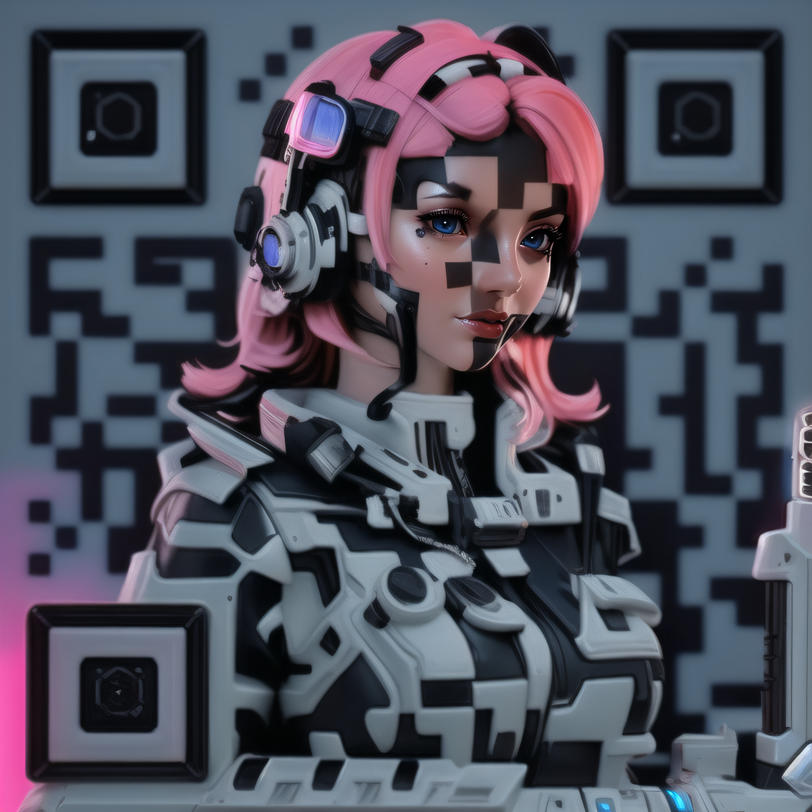

<!-- PROJECT LOGO -->
<r />

  <h3 align="center">QRtist</h3>

    

  

    Стилизуй QR-код со своей ссылкой с помощью Stable Diffusion!
     
     
     
    
    ·
    <a href="https://github.com/elmanoveu/QRtist/issues">Потыкать бота beta</a>
    ·
    <a href="https://github.com/elmanoveu/QRtist/issues">репорт в issue</a>
  

<!-- ABOUT THE PROJECT -->

## О проекте(About the project)
___
QRtist - это Telegram-бот, использующий генеративные нейронные сети для создания потрясающих стилизованных QR-кодов. С помощью QRtist пользователи смогут превращать обычные QR-коды в привлекательные и художественные изображения, что позволит им выделяться и привлекать внимание людей.   
___
QRtist is a bot for Telegram that uses generative neural networks to create stunning stylised QR codes. With QRtist, users will be able to turn ordinary QR codes into attractive and artistic images, allowing them to stand out and catch people attention.
___

(<a href="#readme-top">back to top</a>)
